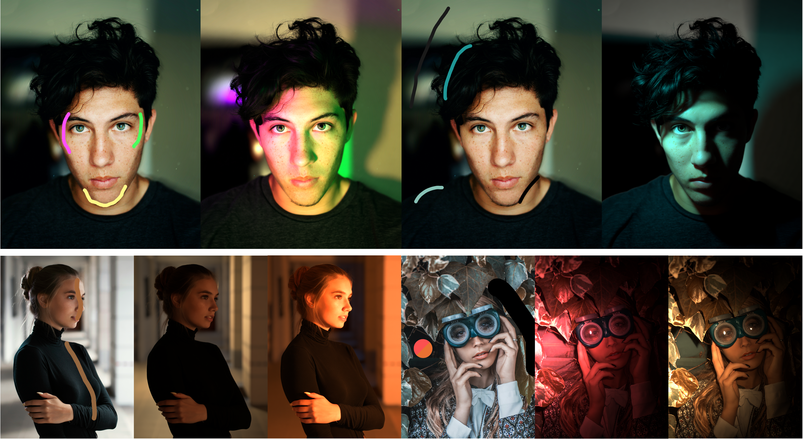

<h1 align="center">DiOR-Light</h1>

<h3 align="center">
Dior: Drawing the Light of Image via Material-Decoupled Illumination Representation
</h3>

  Xuanpu Zhang1,2,3 ·
  Xuesong Niu2 ·
  Haoxiang Cao2 ·
  Jianhao Zeng3 ·
  Ruidong Chen3 ·
  Changqian Yu2,†

  1Tianjin University &nbsp;&nbsp;
  2KlingAI Research &nbsp;&nbsp;
  3Deva Research

  
  

  

  <em>Controlling illumination in images with hand-drawn strokes.</em>

## News

- **2026-08-31:** The interactive [Hugging Face demo](https://huggingface.co/spaces/Little-ECHO/dior-light) is now available.
- **Coming soon:** The source code will be released in this repository. Stay tuned!

## Overview

DiOR-Light is an image relighting method controlled by hand-drawn strokes. It
introduces a material-decoupled illumination representation, the **Lumi Map**,
which creates an explicit connection between sparse user scribbles and the
resulting illumination. This enables intuitive control over illumination
intensity, chromaticity, and complex spatial distributions while preserving
material-consistent appearance.

Try DiOR-Light directly in the [interactive demo](https://huggingface.co/spaces/Little-ECHO/dior-light).

## License

See [LICENSE](LICENSE).
